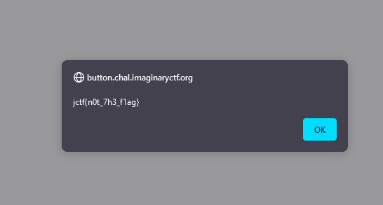
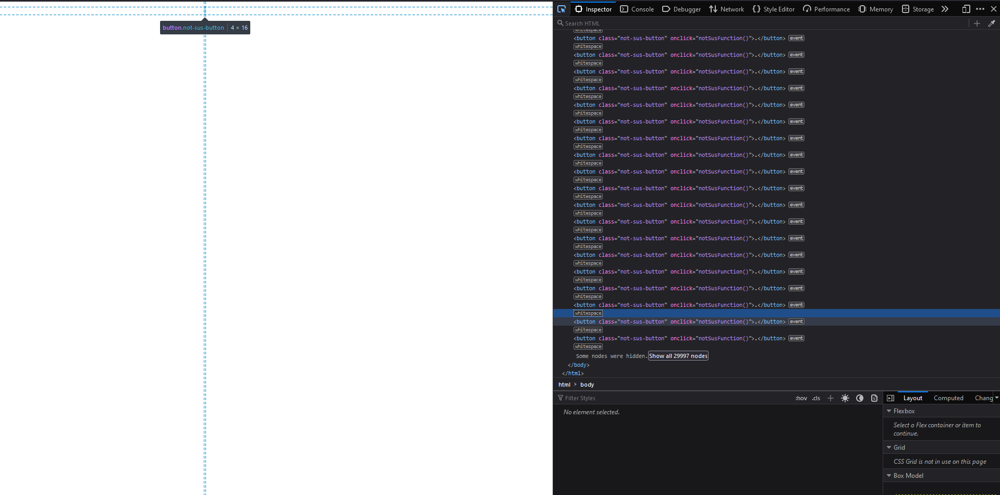
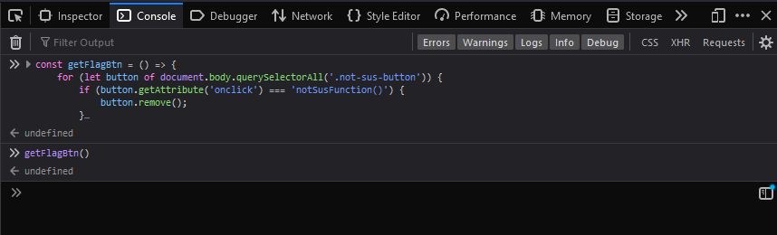
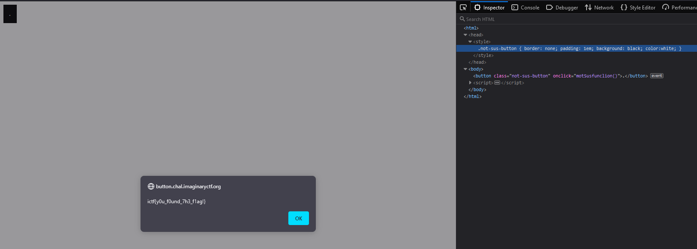
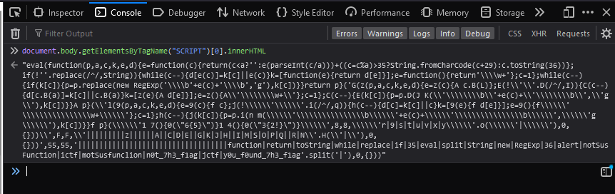

# Button

Open challenge. See blank webpage. Confused (⊙_⊙)？.

Click around a bit. An alert pops up:



There must be invisbile buttons. Right click 'Inspect'. Check DOM.



Correct, there are buttons. Lots and lots of buttons, with `.not-sus-button` CSS class and `notSusFunction()` for `onclick` attribute

So flag is probably linked to button with a different css class or button. We designate the 'flag button'.

Check `<head></head>` on a whim. Notice `<style></style>` tag only has the `.not-sus-button`. So, flag button must also have that same class. Very sneaky.

To get unique button, use `console` to delete all buttons with the `onclick` attribute equal to `notSusFunction()`.

```js
>> const getFlagBtn = () => {
    for (let button of document.body.querySelectorAll('.not-sus-button')) {
        if (button.getAttribute('onclick') === 'notSusFunction()') {
            button.remove();
        }
    }
}
>> getFlagBtn();
```



Check DOM. Update button style so it is visible. Click button. Obtain flag :)



Alternatively, script tag must be hidden in body somewhere because it is not in head.

```js
>> document.body.getElementsByTagName("SCRIPT")[0].innerHTML;
<- "eval(function(p,a,c,k,e,d){e=function(c){return(c<a?'':e(parseInt(c/a)))+((c=c%a)>35?String.fromCharCode(c+29):c.toString(36))};if(!''.replace(/^/,String)){while(c--){d[e(c)]=k[c]||e(c)}k=[function(e){return d[e]}];e=function(){return'\\\\w+'};c=1};while(c--){if(k[c]){p=p.replace(new RegExp('\\\\b'+e(c)+'\\\\b','g'),k[c])}}return p}('G(z(p,a,c,k,e,d){e=z(c){A c.B(L)};E(!\\'\\'.D(/^/,I)){C(c--){d[c.B(a)]=k[c]||c.B(a)}k=[z(e){A d[e]}];e=z(){A\\'\\\\\\\\w+\\'};c=1};C(c--){E(k[c]){p=p.D(J K(\\'\\\\\\\\b\\'+e(c)+\\'\\\\\\\\b\\',\\'g\\'),k[c])}}A p}(\\'l(9(p,a,c,k,e,d){e=9(c){f c};j(!\\\\\\'\\\\\\'.i(/^/,q)){h(c--){d[c]=k[c]||c}k=[9(e){f d[e]}];e=9(){f\\\\\\'\\\\\\\\\\\\\\\\w+\\\\\\'};c=1};h(c--){j(k[c]){p=p.i(n m(\\\\\\'\\\\\\\\\\\\\\\\b\\\\\\'+e(c)+\\\\\\'\\\\\\\\\\\\\\\\b\\\\\\',\\\\\\'g\\\\\\'),k[c])}}f p}(\\\\\\'1 7(){0(\"6{5}\")}1 4(){0(\"3{2!}\")}\\\\\\',8,8,\\\\\\'r|9|s|t|u|v|x|y\\\\\\'.o(\\\\\\'|\\\\\\'),0,{}))\\',F,F,\\'|||||||||z||||||A||C|D|E||G|K|J|H||I|M|S|O|P|Q||R|N\\'.H(\\'|\\'),0,{}))',55,55,'|||||||||||||||||||||||||||||||||||function|return|toString|while|replace|if|35|eval|split|String|new|RegExp|36|alert|notSusFunction|ictf|motSusfunclion|n0t_7h3_f1ag|jctf|y0u_f0und_7h3_f1ag'.split('|'),0,{}))"
```



The flag, `y0u_f0und_7h3_f1ag`, is written at end of string.