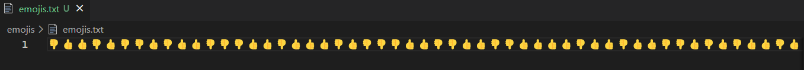

# emojis

Given "emojis.txt". Open and see:



Skim through whole file. Notice only two distinct emoji, thumbs up (👍) and thumbs down (👎).
Maybe this is binary code? But which is "0" and which is "1"?

For now, let 👍=1 and 👎=0. Might swap later, might not.

If txt file contains bits, then does it also contain bytes (groups of 8 bits)?
Bytes can encode ascii characters, so converting bytes to characters might give flag.

```python
# emojis.py
import io
from pathlib import Path

with io.open(Path("emojis.txt"), mode="r", encoding="utf-8") as f:
    emojis_content = f.read()

emoji_bits = emojis_content.replace("👎", "0").replace("👍", "1")
```

Check if file contains integer number of bytes (i.e. length of bits is divisible by 8)

```python
# emojis.py
assert len(emoji_bits) % 8 == 0, "emojis content not grouped into bytes"
```

Ok. Nice, no assertion error.

Finally, convert string of bits to ascii:

```python
# emojis.py
def bits2ascii(b: str) -> str:
    """From https://stackoverflow.com/questions/9916334/bits-to-string-python"""
    BITS_PER_BYTE = 8
    BASE = 2
    return ''.join(chr(int(''.join(x), BASE)) for x in zip(*[iter(b)]*BITS_PER_BYTE))

emoji_flag = bits2ascii(emoji_bits)
print("FLAG", emoji_flag)
```

Ouput:

```
FLAG: ictf{enc0ding_is_n0t_encrypti0n_1b2e0d43}
```

## Reflection

I agree, encoding is not good encryption.